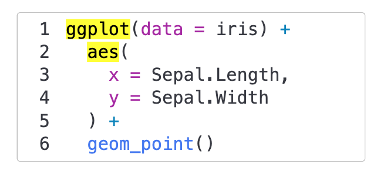

[](https://github.com/ThinkR-open/quarto-detective/actions/workflows/deploy.yml)

# Detective Extension For Quarto

This extension provides a `detective` tool for RevealJS presentations. 🔎

`detective` will highlight a code block in your presentation. It is useful for pointing out specific code in your presentation.

## Installation

You can install the extension with the following command:

```bash
quarto add ThinkR-open/quarto-detective
```

## Usage

Add the plugin to your quarto document:

```yaml
revealjs-plugins:
  - detective
```

Discover the `detective` tool in the presentation below:

[https://thinkr-open.github.io/quarto-detective/](https://thinkr-open.github.io/quarto-detective/)

## Example

Highlight `ggplot` and `aes` in a chunk:

````
:::{.detective data-detective-search="ggplot, aes"}
```{r}
#| echo: true
#| eval: false
ggplot(data = iris) +
  aes(
    x = Sepal.Length,
    y = Sepal.Width
  ) +
  geom_point()
```
:::
````


